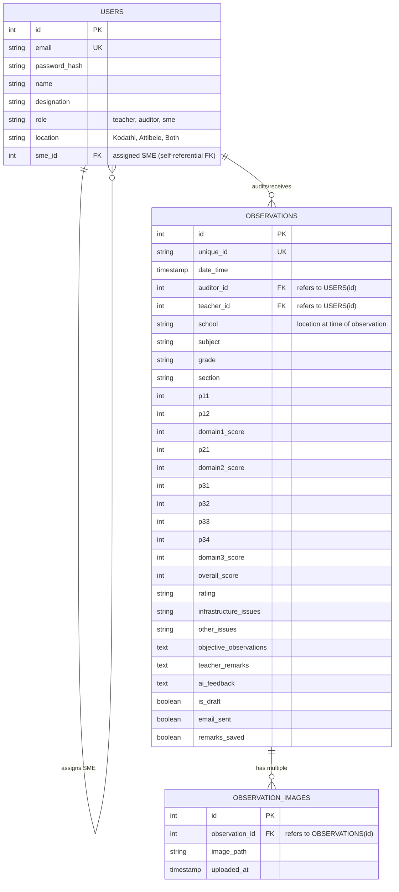

# Teachers Audit Application Migration Plan (Revised V3)

We have updated the implementation plan to use a fully normalized relational database design (with proper foreign keys) and have added support for the upcoming requirement to upload multiple images for an observation.

---

## 1. System Understanding & Requirements

The migrated classroom observation application will serve Harvest International School with the following guidelines:

### User Roles & Permissions:
1. **Auditor** (Chairman, Principal, HOD, Auditor):
   - Accesses the Observation Form to record teacher observations.
   - Rates 7 parameters across 3 Domains on a scale of 1–4 using a rubric (Overall Max Score: 28).
   - Enters live timestamped notes under "Objective Observations".
   - Accesses the Dashboard to view historical performance **for all teachers**.
   - **Drafts:** Can edit AI feedback, edit objective notes, and finalise drafts **only** for observations conducted by themselves. Can see drafts created by others but cannot edit or finalise them.
   - **Progress Comparisons:** Can run AI-based comparisons across multiple observations for any teacher.

2. **SME** (Subject Matter Expert):
   - Accesses the Observation Form to record teacher observations.
   - Rates 7 parameters across 3 Domains on a scale of 1–4 using a rubric (Overall Max Score: 28).
   - Enters live timestamped notes under "Objective Observations".
   - Accesses the Dashboard to view performance metrics and historical reports **only for teachers assigned to them** (where the teacher's config specifies this SME).
   - **Drafts:** Can edit AI feedback, edit objective notes, and finalise drafts **only** for observations conducted by themselves.
   - **Progress Comparisons:** Can run AI-based comparisons for assigned teachers.

3. **Teacher**:
   - Accesses their own dashboard view to view finalised reports, domain scores, and AI feedback.
   - Can submit "Teacher Remarks" back to the system.
   - Cannot view draft (unfinalised) observations.

### Scoring & Rating Thresholds (Standardised /28):
- **DISTINGUISHED:** $\ge 23$
- **PROFICIENT:** $\ge 17$
- **DEVELOPING:** $\ge 12$
- **BEGINNING:** $< 12$

### Email Notifications:
- **Report Finalised:** When an auditor or SME finalises a draft, an email notification is sent to the respective teacher.
- **Remarks Submitted:** When a teacher submits/saves their remarks, an email notification is sent to the auditor who performed that observation.
- **Configuration:** Standard SMTP credentials configured via a local `.env` file.

### Integrations & Services:
- **AI Feedback & Comparisons:** Keep Anthropic's Claude API (using `claude-3-5-haiku` or similar, configured via `.env`).
- **Images (Upcoming):** Support uploading multiple images per audit session.

---

## 2. Proposed Architecture

We propose a modern full-stack web application structure:

- **Frontend:** Single-page React application built with **Vite** and styled using vanilla CSS for premium aesthetics.
- **Backend:** **Python** web service built with **FastAPI** (fast, typed, auto-documented, non-Django).
- **Database:** **SQLite** for local execution (easily switchable to **PostgreSQL** in production) utilizing **SQLAlchemy** ORM.
- **Security:** Password hashing using `passlib` (bcrypt) and API authentication via JWT (JSON Web Tokens).

### Normalized Database Schema (3NF/4NF)

We design a fully normalized relational schema to avoid redundancy and handle the upcoming multi-image upload requirement. The multi-valued attribute of images is separated into a dedicated `observation_images` table, satisfying 4NF.



---

## 3. Project Structure

We will organize the code into frontend and backend directories:

```
AuditApp/
├── backend/
│   ├── app/
│   │   ├── __init__.py
│   │   ├── main.py            # FastAPI App initialization & routing
│   │   ├── config.py          # Environment configuration
│   │   ├── database.py        # SQLAlchemy engine & session setup
│   │   ├── models.py          # SQLAlchemy database models
│   │   ├── schemas.py         # Pydantic schemas for request/response
│   │   ├── crud.py            # Database CRUD operations
│   │   ├── auth.py            # JWT token and password hashing utils
│   │   ├── email_service.py   # SMTP email dispatch utils
│   │   └── ai_service.py      # Anthropic Claude client wrapper
│   ├── requirements.txt       # Python backend dependencies
│   └── .env                   # Environment variables (API keys, SMTP config)
├── frontend/
│   ├── src/                   # React files (components, contexts, api wrapper)
│   ├── package.json           # Frontend dependencies
│   ├── vite.config.js         # Vite configuration (proxies backend API)
│   └── index.html             # Entry page
```

---

## 4. Verification Plan

### Automated Verification
- We will write integration tests in Python (`pytest` + `httpx.AsyncClient`) to verify:
  - User registration, hashing, login, and JWT-token generation.
  - Role-based permissions (e.g., verifying that a teacher cannot access draft observations, and SMEs cannot see non-assigned teachers).
  - Draft validation ownership (verifying that only the auditor who created the draft can finalise it).
  - Image table relationship (verifying multiple image records can associate with an observation).

### Manual Verification
- We will run the local dev environment.
- We will log in as:
  1. **Auditor:** Perform observation, generate AI feedback, check dashboard, edit AI feedback, and finalise. Verify SMTP email is dispatched to the teacher.
  2. **Teacher:** Log in, view finalised observation, fill in remarks, and save. Verify SMTP email is dispatched back to the auditor.
  3. **SME:** Log in, verify restricted view showing only assigned teachers. Edit and finalise their own draft. Verify inability to finalise other auditors' drafts.
